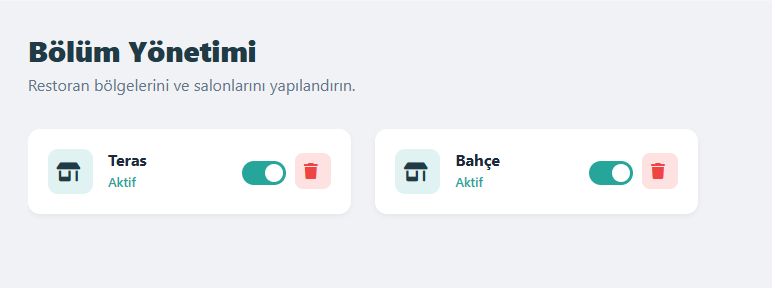
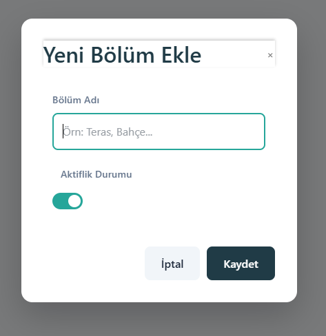
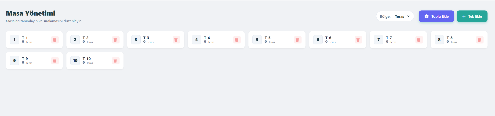
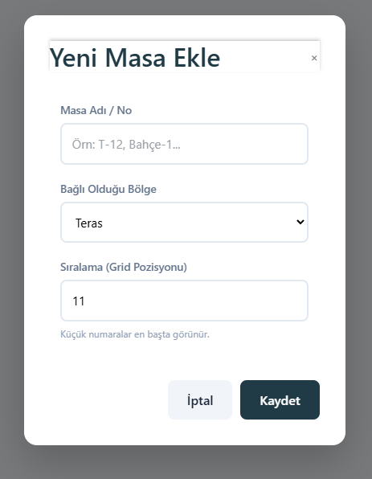
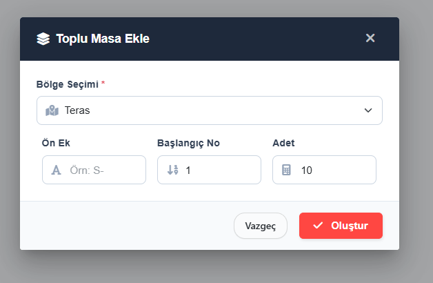
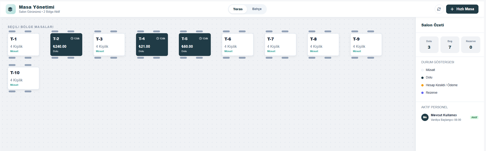
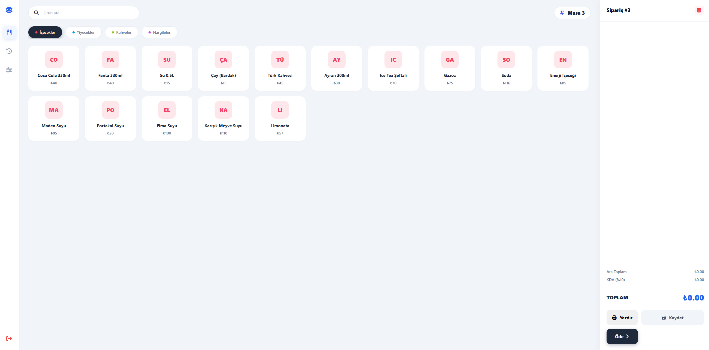
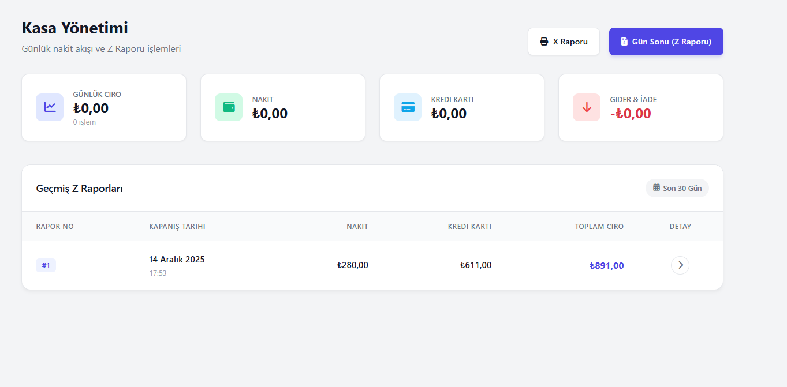
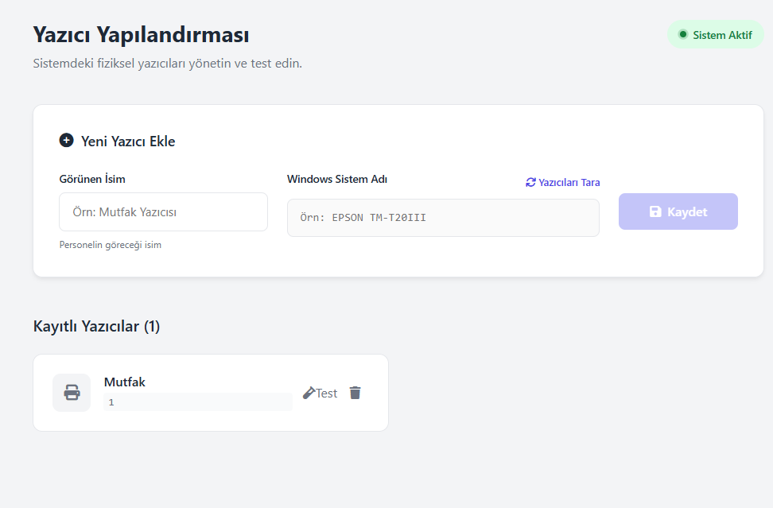

# POS (v1.0.0)

Bu bölüm, BizimPOS uygulamasındaki **POS modülünü** ve temel kullanıcı akışlarını açıklar.  
POS modülü aşağıdaki alt ekranlardan oluşur:

- **Satış**
- **Masalar**
- **Bölümler**
- **Hızlı Satış**
- **Kasa**
- **Yazıcı Tanımları**

---

## Temel Akış (Özet)

POS tarafındaki tipik kullanım akışı şöyledir:

1. **Masa seçilir**
2. **Ürün eklenir**
3. **Ödeme alınır / Masa kapatılır**

---

## v1.0.0 Notu

- **Masalar ekranında otomatik yenileme yoktur.**  
  Masa durumları (dolu/boş) değişse bile, ekran bazı senaryolarda manuel yenileme gerektirebilir.

---

## Bölümler

**Bölümler** ekranı, işletme içindeki alanların/bölgelerin (örn. *Salon, Teras, VIP*) yönetildiği ekrandır.

Bu ekranda:

- Mevcut bölümleri görüntüleyebilir ve yönetebilirsiniz.
- **Silme** butonunun solundaki **toggle** ile bölümün **aktif/pasif** durumunu değiştirebilirsiniz.
- Bir bölüme bağlı **masa yoksa** ilgili bölümü silebilirsiniz.

### Bölüm Ekleme

Yeni bir bölüm eklemek için:

- Bölüm adını girin.
- **Kaydet** işlemiyle oluşturun.

> **Öneri:** Bölüm adlarında standart kullanım tercih edin (örn. `Salon`, `Teras`, `Bahçe`, `VIP`).

---

## Masalar

**Masalar** ekranı, masaların yönetildiği alandır.

Bu ekranda:

- Masaları görüntüleyebilir ve yönetebilirsiniz.
- **Boş** olan masalar uygun koşullarda **silinebilir**.
- Masaları **bölümlere göre** filtreleyip görüntüleyebilirsiniz.

### Toplu ve Tekil Masa Ekleme

#### Tekil Masa Ekleme

Tek bir masa eklemek için:

- Masa adını belirleyin.
- Masanın bağlı olacağı **Bölüm**’ü seçin.
- Masanın **grid pozisyonunu** seçin.

#### Toplu Masa Ekleme

Birden fazla masa eklemek için:

- Oluşturulacak masaların bağlı olacağı **Bölüm**’ü seçin.
- Masalar için bir **suffix/prefix** yapısı belirleyin (örn. `T-1`, `T-2`).
- Sayıların başlangıç indeksini seçin.
- Kaç adet masa oluşturulacağını seçin.

> **Öneri:** Toplu masa adlandırmasını şube standardınıza göre sabitleyin (örn. `T-`, `M-`, `S-`).

---

## Satış

**Satış** ekranı, masaların ve bölümlerin satış operasyonuna göre görüntülendiği ana ekrandır.

Genel davranışlar:

- Masalar **grid** üzerinde yayılmış şekilde görünür.
- Bölümler üst kısımda listelenir ve buradan geçiş yapılır.
- **Dolu masalar** lacivert renkte görüntülenir.
- **Boş masalar** beyaz renkte görüntülenir.

### Masada Satış

Bir masa üzerinden satış başlatmak için:

- Masaya tıklayarak satış ekranını açın.
- **Stok gruplarını** ve **stokları** liste halinde görüntüleyebilirsiniz.
- Sipariş eklemek için ürün üzerine **tek dokunuş/tıklama** yeterlidir.
- **Kaydet** ile siparişi masaya kaydedersiniz.
- **Öde** ile tahsilat alır ve süreci tamamlarsınız.

### Kasa

Kasa ile ilgili detayları görüntüleyebiliriz.

- **Günlük Ciro** , **Nakit** ve **Kart** gibi detayları görüntüleyebiliriz.
- **Gün Sonu** butonuyla Z raporu alıp günü tamamlayabiliriz.

### Yazıcı Tanımları

Yazıcı tanımlarının yapıldığı alandır.

- **Windows Sistem Adı** ve **Görünen İsim** gibi detayları görüntüleyebilir, ekleyebiliriz.
- **Gün Sonu** butonuyla Z raporu alıp günü tamamlayabiliriz.

---

## Notlar

- Bölüm silmeden önce, bölüme bağlı masaların olmadığından emin olun.
- Toplu masa eklerken isimlendirmeyi baştan standartlaştırmak, raporlama ve operasyon tarafında işleri kolaylaştırır.
- Satış ekranında masa durumları güncel görünmüyorsa, v1.0.0 sürüm notuna göre manuel yenileme gerekebilir.

