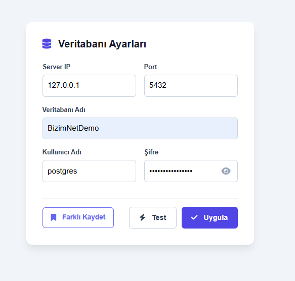
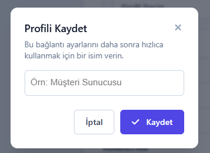
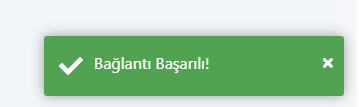
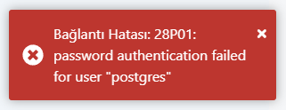

# Veritabanı Ayarları (v1.0.0)

Bu sayfa, BizimPOS uygulamasında **veritabanı bağlantı ayarlarının** nasıl yönetileceğini açıklar.  
Ayar ekranı üzerinden yeni bağlantı tanımlayabilir, mevcut bağlantıları kaydedebilir, bağlantıyı test edebilir ve uygulamaya alabilirsiniz.

---

## Ekran Görünümü

Aşağıda **Veritabanı Ayarları** ekranı görüntülenmektedir:

---

## Farklı Kaydet

**Farklı Kaydet** alanı, mevcut bağlantı ayarlarınızı ayrı bir adla kaydederek farklı ortamlar/şubeler arasında hızlıca geçiş yapmanızı sağlar.

Örnek kullanım senaryoları:
- **Şube-1** ve **Şube-2** veritabanları arasında geçiş
- **Test** ve **Canlı** ortam bağlantılarının ayrı tutulması
- Sahada birden fazla müşteriye destek verirken bağlantıları ayrı kaydetme

> **Öneri:** Kaydederken anlamlı isimlendirme kullanın (örn. `Sube-1 (Prod)`, `Merkez (Test)` gibi).

---

## Test

**Test** butonu, girdiğiniz bağlantı bilgileriyle veritabanına erişim sağlanıp sağlanamadığını kontrol eder.

### Başarılı Sonuç
Bağlantı başarılıysa aşağıdaki gibi bir başarı mesajı görüntülenir:

### Başarısız Sonuç
Bağlantı başarısızsa, sistem neden başarısız olduğuna dair hata mesajı gösterir:

**Sık görülen nedenler**
- Sunucu adresi (Host/IP) hatalı
- Port hatalı veya firewall tarafından engelleniyor
- Kullanıcı adı/şifre yanlış
- Veritabanı adı yanlış
- PostgreSQL servisi çalışmıyor

---

## Uygula

**Uygula** butonu, mevcut bağlantı ayarlarınızı kaydeder ve uygulamanın bu bağlantıyı kullanmasını sağlar.

> **Not:** “Uygula” işlemi sonrası uygulama davranışında değişiklik bekleniyorsa, bazı senaryolarda ekran yenileme / yeniden giriş gerekebilir.

---

## Dikkat

- Canlı ortam şifrelerini gereksiz yere paylaşmayın; mümkünse **kısıtlı yetkili** kullanıcı kullanın.
- Test bağlantısını **önce çalıştırın**, ardından “Uygula” yapın.
- Eğer sahada birden fazla bağlantı kullanıyorsanız, kayıt isimlerinizi standartlaştırın.

